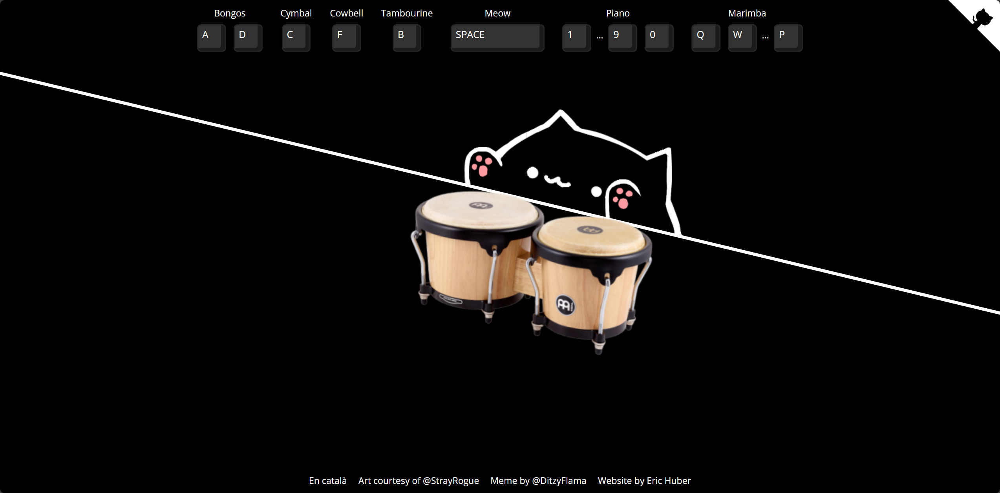
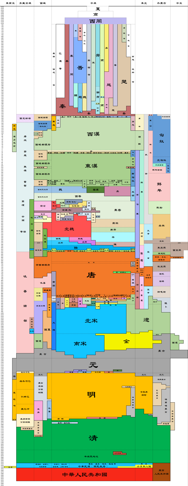
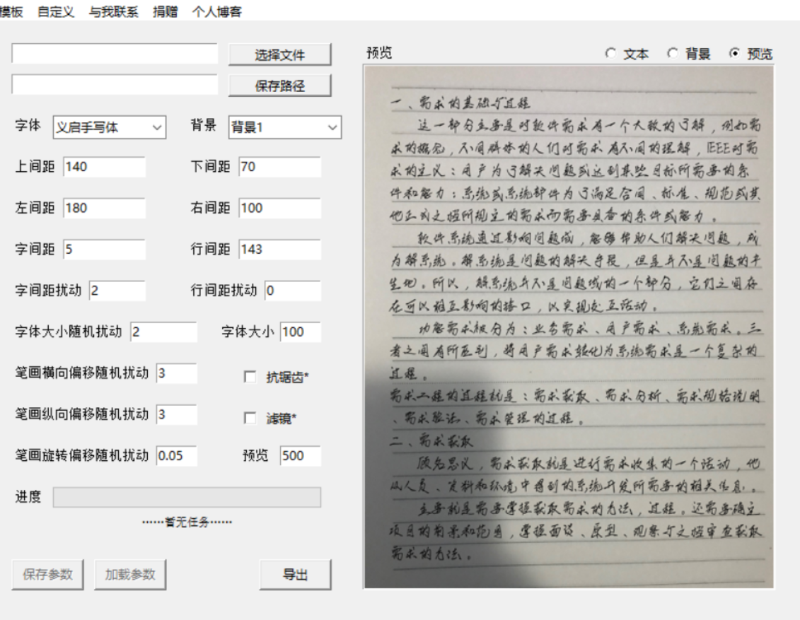
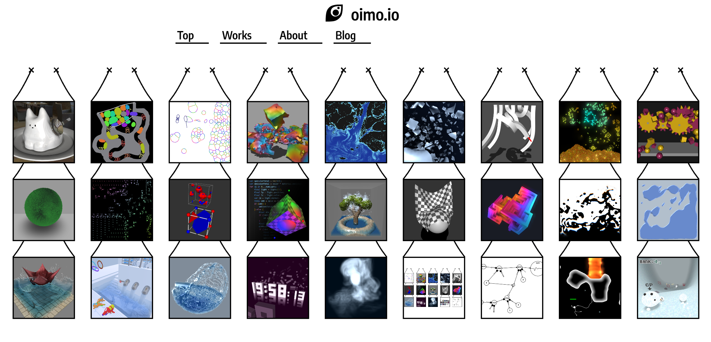
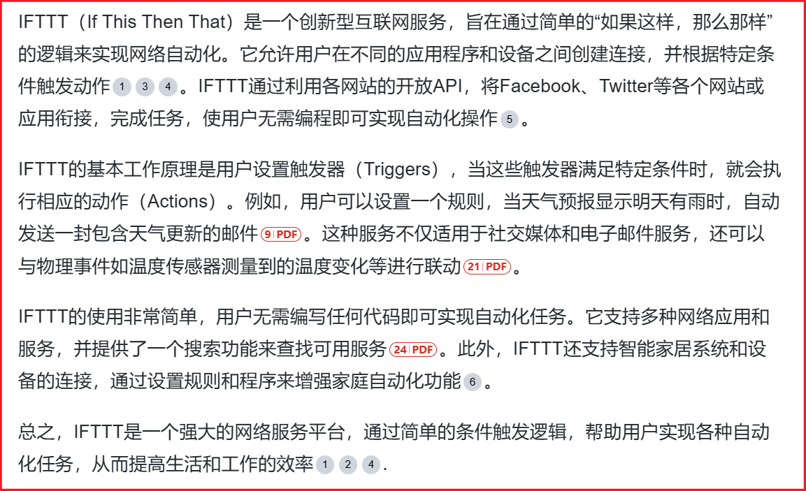
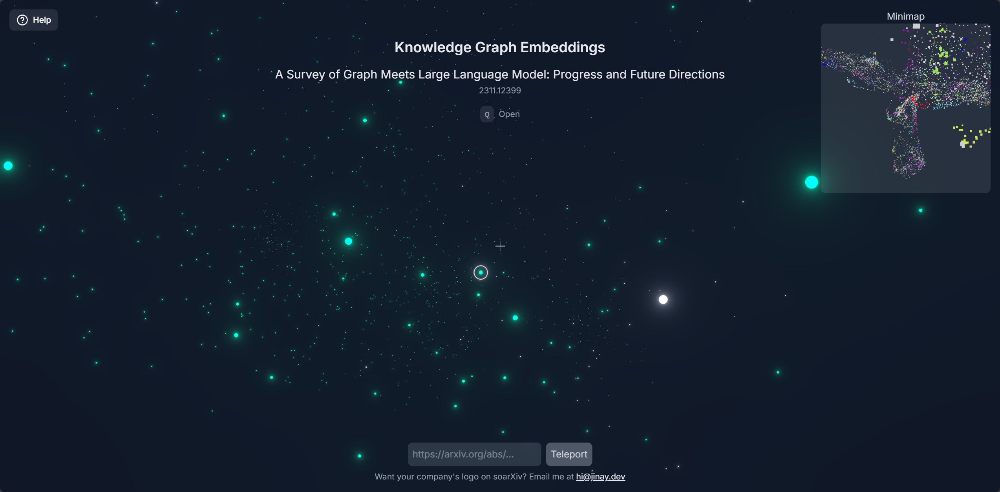

# **👋**Mr.Mark-s-Box

Hey guys, this is Mr. Mark's box. When we encounter good things on the Internet, we always want to mark it. So with this project.

|                            项目名                            |                             描述                             |                             备注                             |
| :----------------------------------------------------------: | :----------------------------------------------------------: | :----------------------------------------------------------: |
|                 [pokigame](https://poki.com)                 | 在线小游戏网站。很多童年4399的小游戏都能玩到，无需注册/登录  |                             null                             |
| [RunCat_for_windows](https://github.com/Kyome22/RunCat_for_windows) | 在 Windows 任务栏飞奔的“小猫”。这是一个用C#写的小工具，它会在 Windows 任务栏显示一只奔跑的小猫动画，CPU使用率越高它跑得越快  |                   奔跑的小猫？别太可爱啊！                   |
|       [marker](https://github.com/VikParuchuri/marker)       |               快速准确地将 PDF 转换为 Markdown               | 这类项目挺多的，office文件转markdown一直是我关注的话题，因为目前来说没有特别完美的解决方案（都需要后续微调）。有机会试试 |
| [fabritor-web](https://github.com/sleepy-zone/fabritor-web)  | 一款基于 fabricjs 的开源创意图片编辑器，旨在让开发者快速构建属于自己的图片编辑器。可应用于海报设计、小红书公众号封面设计、banner 设计等场景 |                             null                             |
|        [思通舆情](https://gitee.com/stonedtx/yuqing)         | 一款开源免费的舆情系统  | 开源的舆情系统，看着挺不错的，感觉很多类似产品都是套的这个壳子 |
|            [有趣网址之家](https://youquhome.com/)            |                   旨在收藏全球最有趣的网站                   |           闲的没事可以看看，奇奇怪怪的网站又增加了           |
|                     Mac破解软件下载平台                      | https://www.digit77.com/macapps/ https://macwk.cn/ https://appstorrent.ru/ https://xmac.app/ https://www.macbed.com/ https://xclient.info/ https://maczz.net/ https://macked.app/ https://macapp.org.cn https://www.macserialjunkie.com/ https://www.ifunmac.com https://foxirj.com/ https://xclient.info/ |  国内外口碑比较高的Mac软件破解资源，但是还是要注意甄别后门   |
| [植物大战僵尸杂交版](https://space.bilibili.com/97213827/dynamic) |                             null                             |                原作者【潜艇伟伟迷】，免费下载                |
|             [Asciinema](https://asciinema.org/)              |                          终端录制器                          |          专门用于录制终端的工具，感觉外网用的比较多          |
|   [wooden-fish](https://github.com/Ares-Chang/wooden-fish)   | 使用 solidjs 构建的电子木鱼 |          左手键盘，右手木鱼。一边搞科学，一边搞玄学          |
|   [bongo.cat](https://github.com/Externalizable/bongo.cat)   | 像Bongo Cat一样打手鼓 在线网址：https://bongo.cat/  |            Bongo Cat超级可爱的，很解压的一个项目             |
|             [皮卡搜索 ](https://www.pikaso.top/)             | 网盘聚合搜索引擎  |               适用了一下，感觉搜资源还是不错的               |
|           [我爱分享网](http://www.zhanshaoyi.com/)           |                       破解软件资源网站                       |                             null                             |
|        [中国大学校徽矢量图](https://www.urongda.com/)        |                  全国各大高校的矢量校徽资源                  |                             null                             |
|                [GitRoll](https://gitroll.io/)                |                 GitHub 个人资料在线分析工具                  |                    个人资料分析？有空试试                    |
|              [IPCheck](https://ipcheck.ing/#/)               |                Mjj 最好的开源 IP 在线检测工具                |                          感觉还不错                          |
|            [地图集](https://www.davidrumsey.com/)            |                    古地图、历史地图收藏站                    |                             null                             |
|                           11个能力                           |                |                   也许以后做励志演讲用得到                   |
|                   编程语言及其创立年份概览                   |  |                      总感觉少了点什么🤔                       |
|                      中国历史朝代跨度表                      |        |                  这种全图就给人很震撼的感觉                  |
| [lychee-action](https://github.com/lycheeverse/lychee-action) | 一个Rust编写的Github Action，可以检查markdown、HTML、txt中的失效网址 | 简单使用了一下，如果网址来自于多个国家，可能明明有效也会报无法访问，因为网络环境比较复杂，有些国家可能禁止GitHub对其境内站点做请求 |
|  [wechatDownload](https://github.com/qiye45/wechatDownload)  |                  微信公众号文章批量下载工具                  |                          感觉还不错                          |
|         [手写模拟器](https://www.iamzlt.com/?p=602)          |  |                             null                             |
|                           ZLibrary                           |        https://zh.go-to-zlibrary.se/#desktop_app_tab         |           支持 16 种语言版本、490多万本电子书资源            |
|                          SaltTiger                           |                    https://salttiger.com/                    | 大厂出品的编程电子书集结，涵盖Python、C++、C#、Java、Android、iOS 等领域！ |
|                            内酷网                            |           [http://neikuw.com](http://neikuw.com/)            |                    通过百度网盘分享电子书                    |
|                           恩京书房                           |      [https://www.enjing.com](https://www.enjing.com/)       |                 界面非常好，提供多种格式下载                 |
|                           三秋书屋                           |          [https://www.d4j.cn](https://www.d4j.cn/)           |                    新站，通过百度网盘下载                    |
|                           sobooks                            |          [https://sobooks.cc](https://sobooks.cc/)           |                       kindle电子书社区                       |
|                           沉金书屋                           |    [https://www.chenjin5.com](https://www.chenjin5.com/)     |                     需关注公众号才能下载                     |
|                          火岸电子书                          |           [https://huoan.net](https://huoan.net/)            |                       书不多，网盘分享                       |
|                         电子书根据地                         |       [http://www.66books.cn](http://www.66books.cn/)        |                   需关注微信公众号才能下载                   |
|                          相识电子书                          |  [http://www.xiangshi123.com](http://www.xiangshi123.com/)   |                 通过百度网盘分享，有些失效了                 |
|                          电子书基地                          |           [http://www.dzs.so](http://www.dzs.so/)            |                        书不多，更新慢                        |
|                            爱悦读                            |        [https://www.iyd.wang](https://www.iyd.wang/)         |                     量少，有一阵子未更新                     |
|                           看kindle                           |  [https://www.lookkindle.com](https://www.lookkindle.com/)   |                    需注册，部分资源需付费                    |
|                            花卷妈                            |    [http://www.huajuanma.com](http://www.huajuanma.com/)     |                      专注儿童电子书资源                      |
|                            知识库                            |  [https://book.zhishikoo.com](https://book.zhishikoo.com/)   |             界面友好，无需注册，通过百度网盘下载             |
|                            逗分享                            |      [http://book.idoubi.net](http://book.idoubi.net/)       |                     广告多，下载比较麻烦                     |
|                           读书达人                           |   [http://www.dushudaren.com](http://www.dushudaren.com/)    |                       需关注微信公众号                       |
|                           书山有路                           |        [http://www.ssylu.com](http://www.ssylu.com/)         |                    博客式电子书分享下载站                    |
|                             壹书                             |      [http://www.onebooks.cn](http://www.onebooks.cn/)       |                         有书单有资源                         |
|                        微米电子书分享                        |       [https://www.dzsfx.com](https://www.dzsfx.com/)        |                         通过网盘分享                         |
|                         rejoice博客                          |  [http://www.rejoiceblog.com](http://www.rejoiceblog.com/)   |                      博客式电子书下载站                      |
|                            锐读网                            |      [https://www.readuu.com](https://www.readuu.com/)       |                       通过百度网盘分享                       |
|                          精品电子书                          |             https://dylanbai8.github.io/ideahub              |           基于github，约10G电子书，都是2015年前的            |
|                          技术电子书                          |          [http://jsebook.com](http://jsebook.com/)           |              技术类书籍，下载需注册登陆，书不多              |
|                            书栈网                            |    [https://www.bookstack.cn](https://www.bookstack.cn/)     |                   开源IT类书籍、文档分享站                   |
|                          码农电子书                          |        [https://book.mzh.ren](https://book.mzh.ren/)         |                    IT类书站，书少(已停更)                    |
|                          SaltTiger                           |       [https://salttiger.com](https://salttiger.com/)        |                        每天一本编程书                        |
|                          我的黄金屋                          |         [http://goldroom.top](http://goldroom.top/)          |                            需注册                            |
|                          风陵渡书屋                          |       [http://www.eybook.com](http://www.eybook.com/)        |                             新站                             |
|                           掌上书苑                           |      [https://www.soepub.com](https://www.soepub.com/)       |                            需注册                            |
|                           我爱书籍                           |        [http://www.52book.me](http://www.52book.me/)         |                          分类较简单                          |
|                           AIBOOKS                            |        [https://aibooks.club](https://aibooks.club/)         |                  需关注微信公众号获取提取码                  |
|                           Moreread                           |          [http://moreread.me](http://moreread.me/)           |                    数不多，需注册，可推送                    |
|                          kindlefree                          |    [http://www.kindlefree.cn](http://www.kindlefree.cn/)     |                    不提供下载，注册后推送                    |
|                           kindle吧                           |  [https://www.shuyingyin.com](https://www.shuyingyin.com/)   |                           书站导航                           |
|                            辣豆瓣                            |         [http://ladouban.com](http://ladouban.com/)          |                     界面友好，有书单书摘                     |
|                             分享                             |    [http://book.share2uu.com](http://book.share2uu.com/)     |                         书籍数量不小                         |
|                            推书圈                            |     [http://www.vzhuanba.com](http://www.vzhuanba.com/)      |                         新站，书较少                         |
|                          三分钟书屋                          | [https://www.sanfenzhong.net](https://www.sanfenzhong.net/)  |                  模仿我的小书屋，已断更数月                  |
|                           书堆阅读                           |    [https://www.werebook.com](https://www.werebook.com/)     |                          书不算太多                          |
|                           芒果读书                           |            [http://diumx.com](http://diumx.com/)             |                      精校电子书，需注册                      |
|                           千秋书在                           |       [https://www.qqszz.com](https://www.qqszz.com/)        |                        游客可免费下载                        |
|                             书聚                             |           [http://ebookg.com](http://ebookg.com/)            |                            需付费                            |
|                            图书网                            |      [http://www.ziliaoh.com](http://www.ziliaoh.com/)       |                           资源尚可                           |
|                             书单                             |      [https://ebooklist.mobi](https://ebooklist.mobi/)       |                   需关注微信公众号才能下载                   |
|                           KDBooks                            |      [https://www.kdlbook.cn](https://www.kdlbook.cn/)       |                   需关注公众号，获取验证码                   |
|                          爱分享读书                          |   [http://www.ishareread.com](http://www.ishareread.com/)    |                            需注册                            |
|                          电子书下载                          |        [https://bookzhai.com](https://bookzhai.com/)         |               新站，量不大，而且有一阵子没更新               |
|                             Nmod                             |        [https://www.nmod.net](https://www.nmod.net/)         |                    书不多，但好在质量不错                    |
|                            淘书党                            |  [https://www.taoshudang.com](https://www.taoshudang.com/)   |    大部分书需关注微信公众号后才能下载，而且还得看站长时间    |
|                            点书网                            |   [http://www.gezhongshu.com](http://www.gezhongshu.com/)    |                 需注册登录，免费下载次数有限                 |
|                           读书小站                           |       [https://ibooks.org.cn](https://ibooks.org.cn/)        |                     确实是小站，更新较慢                     |
|                            辣豆瓣                            |         [http://ladouban.com](http://ladouban.com/)          |   每本书读提供了豆瓣评分，需关注网站微信公众号获取密码下载   |
|                            Iread                             |         [http://www.iread.cf](http://www.iread.cf/)          |               需要注册，免费用户一天可下载三本               |
|                             zure                             |            [https://zure.fun](https://zure.fun/)             |                        需注册，还不错                        |
|                            走读派                            |     [http://www.zoudupai.com](http://www.zoudupai.com/)      |                           书站导航                           |
|                          Kindle伴侣                          |               [https://bookf](https://bookf/)                |                             null                             |
|                    中小学电子教材下载站点                    |                 https://textbook.synaiv.com/                 |                             null                             |
|           [Python Tutor](https://pythontutor.com/)           | 一个蛮实用的针对初学者和开发者的代码可视化学习工具。可以帮助初学者和有经验的开发者更好地理解和可视化 Python 代码的执行过程。你可以在网站上输入 Python 代码，然后通过可视化工具逐步查看代码的执行过程，除了 Python，网站还支持 Java、JavaScript、TypeScript、Ruby、C 和 C++ 等编程语言。 |      蛮有意思的，相比起初学者我觉得对资深开发者更有用。      |
|          [好学电子课本网](http://www.5haoxue.net/)           |              一个免费在线中小学电子教材试卷网站              |                             null                             |
|        [justinesoulie.fr](https://justinesoulie.fr/)         | 一本在线的艺术杂志，可视化的展现了很多有趣的内容 |                             null                             |
|           [Works - oimo.io](https://oimo.io/works)           | 一些有趣的前端动画效果 |                             null                             |
|    [精选的网页设计灵感目录 ](https://www.curated.design/)    |                  一个收纳网页设计灵感的网站                  |                   多是一些有特色的产品官网                   |
|       [Free for Developers ](https://free-for.dev/#/)        |         一个专门来整理可以免费使用的开发者工具的站点         |                             null                             |
| [阿里巴巴前端知识图谱](https://f2e.tech/?spm=a21iq3.home.0.0.4ad52764RX6NMP) | 一个将前端的一些知识点可视化的利用图谱的方式呈现出来的一个网站 |                             null                             |
|         [Wayback Machine ](https://web.archive.org/)         |   互联网时光机，可以看到几乎大部分互联网上的网页的演变历史   |                             null                             |
|              [IFTTT](https://ifttt.com/explore)              |  |              口碑一直挺不错的，有需求的时候试试              |
|          [MacroDroid](https://www.macrodroid.com/)           |                安卓上类似于苹果快捷指令的 APP                | 算自动化的一种，可以完成一些简单的自动化操作，感觉不如语音助手来的方便 |
|                在线体验各个版本的 Windows系统                | Windows 1.01/3.1/95/98/2000/MS-DOS 6.22 ( https://copy.sh/v86/ ) Windows 93 ( https://www.windows93.net/ ) Windows 98 ( https://98.js.org/ ) 🌐开源地址 ( https://github.com/1j01/98 ) Windows XP ( https://winxp.vercel.app/ ) 🌐开源地址 ( https://github.com/ShizukuIchi/winXP ) Window 7 ( https://nainemom.github.io/win7/ ) 🌐开源地址 ( https://github.com/nainemom/win7 ) Window 8 ( https://kishlaya.github.io/Windows-Web-8/ ) 🌐开源地址 ( https://github.com/kishlaya/Windows-Web-8 ) Window 10 ( https://win10.webjeet.me/ ) Windows 11 ( https://win11.blueedge.me/ ) 🌐开源地址 ( https://github.com/blueedgetechno/win11React ) Windows 12 ( https://tjy-gitnub.github.io/win12/desktop.html ) 🌐开源地址 ( https://github.com/tjy-gitnub/win12 ) |                             有趣                             |
|                  [Slidev](https://sli.dev/)                  |                     用markdown语法做PPT                      |                             null                             |
|            [Excalidraw](https://excalidraw.com/)             |                         手绘风流程图                         | 试了下，还挺有意思的，数据保留在本地，不过中文手写字体好像要自己上传 |
| [A Real Me - Test to Know Yourself](https://www.arealme.com/) | 一个整合了各种性格测试网站。 如果你想了解MBTI性格测试直接看这个：[16型人格雷达图分布测试 (中文)](https://www.arealme.com/16-personality-test-radar-version/cn/)、[16型人格雷达图分布测试 (英文)](https://www.arealme.com/16-personality-test-radar-version/cn/) |                             null                             |
|  [Fey’s logo database](https://www.fey.com/marketing/logos)  |           收录三千多个公司的产品图标（如Youtube）            |                             null                             |
|                   https://www.svglogo.top/                   |           收录国内一些公司产品图标（如抖音、快手）           |                             null                             |
|        [中国哲学书电子化计划 ](https://ctext.org/zhs)        |    一个线上开放电子图书馆，为中外学者提供中国历代传世文献    |                             null                             |
|    [最简单实用的在线计算器 ](https://calcopedia.com/zh/)     |       提供超过50个各种计算器、转换器，同时支持16种语言       |                             null                             |
|                      查看行业数据的网站                      | 艾瑞：www.iresearch.com.cn，互联网、金融、电商等多个热门行业数据报告。 199IT：www.199it.com，中文互联网数据资讯网。 亿欧：www.iyiou.com，一个专注于新经济和产业创新的综合性服务平台。 前瞻产业研究院：[qianzhan.com](https://bg.qianzhan.com/)，一个以产业研究为主的机构，其报告涵盖了多个传统和新兴行业。 MBA智库：www.mbalib.com，一个集知识管理、案例研究、行业报告等功能于一体的综合性平台。 创业邦研究报告：www.cyzone.cn，整合了多个机构的研究报告，内容覆盖各个互联网行业，更新及时，为创业者提供优质的研究报告数据。 飞瓜数据：www.feigua.cn，短视频直播电商数据分析平台。 友望数据：www.youwant.cn，视频号数据分析平台。 新抖：xd.newrank.cn，短视频及直播数据工具。 蝉妈妈：www.chanmama.com，内容营销与电商增长一站式服务平台。 热榜：[smzdk.top](https://smzdk.top/#/) CBNdata：www.cbndata.com，消费研究报告 MobTech研究院：www.mob.com/mobdata/report ，行业洞察报告 甲子光年：www.jazzyear.com，一家包含媒体、智库、社群、企业服务版块的精品科技产业服务机构 巨量算数：[oceanengine.com](https://trendinsight.oceanengine.com/)，客观、深刻的数据洞察，洞悉行业前沿 每日报告：www.mrbaogao.com，一个行业研究报告大全网站 镝数聚网：www.dydata.io，行业数据报告综合服务平台 |                             null                             |
|         [纪妖（原名知妖）](https://www.cbaigui.com/)         |                一个收集古今妖怪相关信息的站点                |        有时间是真想把这些全都看一遍，想想就感兴趣啊！        |
|         [When They Work ](https://whenthey.work/zh)          |             快速查看指定国家或城市是否在工作时间             |                             null                             |
|                 [句乐部](https://julebu.co/)                 |                  一个开源的在线学习英语网站                  |               还挺多人推这个站的，感觉风评不错               |
| [AE模板下载站](https://www.newcger.com/aemoban/list_1.html?t3=60) |                     分享了一些AE特效模板                     |                             null                             |
|         [MacOS应用图标站](https://macosicons.com/#/)         |                   收集了很多MacOS应用图标                    |                             null                             |
|                 https://comparingheight.com/                 |                 一个简单的可视化身高比较平台                 |                          挺有意思的                          |
|               [漫本](https://www.manben.com/)                |         一个原创漫画发行平台，提供丰富的在线漫画资源         |                             null                             |
|     [Notion风格头像制作 ](https://notion-avatar.app/zh)      |                   一个Notion风格头像生成器                   |          挺有意思的，这种风格Notion狂热者应该会喜欢          |
| [B站美化扩展插件](https://github.com/BewlyBewly/BewlyBewly)  |           一个对网页端BiliBili进行美化的浏览器扩展           |                  很有设计感，有机会可以试试                  |
|   [PixPin - 强大且免费的截图贴图工具](https://pixpin.cn/)    |                      一个强大的截图工具                      | 简单用了一下，还不错，基本上可以代替Utools、Snipasted的图处理功能，可惜我已经用习惯了，不太想换，没用过其他截图工具的可以闭眼冲 |
| [AI Reading List](https://tidyread.ai/recommended-recipes/ai-reading-list-pro-cn) |                     一个AI投资人优质信源                     |               信源质量很高，玩AI投资可以关注下               |
| [superDMS](https://github.com/superDMS/HsFreezer-Hidden-in-the-snow-) |      一个可以冻结游戏进程并释放资源和随时恢复进程的软件      |                听起来挺酷的，有需要的时候试试                |
|  [xiaosongQRfont](https://github.com/hnzxs/xiaosongQRfont)   |     一款二维码字体库，简单来说就是把一个字转为一个二维码     |                      脑洞挺大的整活项目                      |
|                   各版本纯净Windows镜像站                    | 微软官方系列镜像站： https://www.microsoft.com/zh-cn/software-download i tell you： https://next.itellyou.cn/ 山己几子木： https://msdn.sjjzm.com/ 系统库： https://www.xitongku.com/ |                             null                             |
|          [Cheatography](https://cheatography.com/)           |                 一个速查表（备忘单）集合网站                 |                   涉及各种领域，还挺实用的                   |
|      [中国五级行政区划查询](https://map.ruiduobao.com/)      | 可以查询中国省、市、县、乡镇和村的区划数据，看到各种隶属关系 | 听说是作者历时四年归纳、反推、整理的数据，以后有做地理信息系统相关业务可以回来看看 |
|             国内教育/教培行业各种资料（含教材）              | 教材：[https://github.com/TapXWorld/ChinaTextbook](https://github.com/TapXWorld/ChinaTextbook) 教育各种资料：[https://github.com/mswnlz/edu-knowlege](https://github.com/mswnlz/edu-knowlege) 国家中小学智慧教育平台电子课本下载工具：[https://github.com/happycola233/tchMaterial-parser](https://github.com/happycola233/tchMaterial-parser) 国家中小学智慧教育平台：[https://basic.smartedu.cn/](https://basic.smartedu.cn/) |                             null                             |
| [The Piracy Glossary ](https://rentry.org/The-Piracy-Glossary#music-terms) |                     一个资源类术语集合站                     | 大概看了下，主要介绍的是找资源时（如动漫、音乐、视频、游戏等）会常看见的一些术语 |
|                [GitFlic](https://gitflic.ru/)                | 一个俄罗斯本土化的代码托管平台，旨在为开发者提供类似 GitHub 的服务，同时注重本地化支持和安全性 |                             null                             |
|            [WhatRuns](https://www.whatruns.com/)             |                  用于识别网站上使用到的技术                  | 用的少，我一般用Wappalyzer。并且感觉在渗透测试时这类工具的存在感很低，好像做了什么又好像什么都没做 |
|           [PixelSnap](https://getpixelsnap.com/zh)           | 一款macOS应用程序，设计师和网页开发者只需点击和拖动光标，就可以轻松地测量屏幕上的任何东西。只需在周围的区域拖动，便会立即自动地找到任何物体的边界 |   前端设计师经常用到工具，之前看过类似的，不知道是不是这款   |
|              [Tailscan](https://tailscan.com/)               | 一款Tailwind CSS浏览器扩展，以可视化方式构建、设计和调试 Tailwind 网站 |           接上文 ↑ ：找到了，我之前看到过的是这款            |
|     [Tickeys](https://www.yingdev.com/projects/tickeys)      | 一款打字音效软件 | 小时候的手机输入法就自带打字音效，没想到PC也有这种软件，可以抱着梦回童年的心理玩一玩 |
|            [FakeUpdate](https://fakeupdate.net/)             |            在屏幕上展示一个假的 Windows 更新画面             |                             null                             |
|               [soarXiv](https://soarxiv.org/)                | 一个将[arXiv](https://arxiv.org/)论文可视化为宇宙星系的站点 |                             null                             |
| [新经济倒闭公司数据库](https://www.itjuzi.com/deathCompany)  |                         死亡公司公墓                         |                             null                             |
|         [PUBG](https://github.com/kiccer/Soldier76)          |            罗技鼠标宏，Logitech鼠标宏自动压枪脚本            |                             null                             |
|          [大学生活质量指北](https://colleges.chat/)          | 收集全国各高校招生时不会写明，却会实实在在影响大学生活质量的要求与细节。开源项目地址：[CollegesChat/university-information](https://github.com/CollegesChat/university-information) |                       这将是个英雄项目                       |
| [加密货币交易所安全风险指南精编](https://github.com/nexvault/CEX-Security) |             梳理了Web3交易所的风险场景及安全工作             |                             null                             |
|      [js-to-exe](https://github.com/astracompiler/cli)       |        能直接将 JS/TS 代码编译成独立可运行的 exe 文件        |                   有点意思，有空的时候试试                   |
| [trendingrepos](https://trendingrepos.glup3.dev/?time=daily) | 一个增强版的 GitHub 趋势页面，支持查看不同时间段（日、周、月）内星标最多的 GitHub 仓库排行榜。开源项目地址：[Glup3/trendingrepos](https://github.com/Glup3/trendingrepos) |                             null                             |
|            [paotuan.io](https://www.paotuan.io/)             | 一个跑团平台/跑团机器人/跑团骰子。开源项目地址：[paotuan/qqchannel-bot](https://github.com/paotuan/qqchannel-bot) |                     跑团看起来挺有意思的                     |
|                [Onlook](https://onlook.com/)                 | 一款开源的前端可视化IDE，专为 React 应用设计，允许用户通过浏览器实时修改 UI 并自动将设计更改同步为代码。开源项目地址：[onlook-dev/onlook](https://github.com/onlook-dev/onlook) |                        有空可以玩一下                        |
|           [Screen Studio](https://screen.studio/)            |                      一款macOS录屏软件                       |       我看中了它丝滑的动效，十分适合录制电脑教程类视频       |
|         OBS鼠标区域放大+鼠标跟随（鼠标跟随录制）插件         | [OBS Lua - Zoom to Mouse](https://obsproject.com/forum/resources/zoom-to-mouse.1823/) [BlankSourceCode/obs-zoom-to-mouse](https://github.com/BlankSourceCode/obs-zoom-to-mouse) |                             null                             |
|                微软官方出品/推荐的效率工具集                 | [Sysinternals 实用工具](https://learn.microsoft.com/zh-cn/sysinternals/downloads/) [Microsoft PowerToys](https://learn.microsoft.com/zh-cn/windows/powertoys/) |                             null                             |
| [ZoomIt](https://learn.microsoft.com/zh-cn/sysinternals/downloads/zoomit) | 用于技术展示和演示的屏幕缩放、注释和录制工具，支持屏幕画笔、鼠标区域放大、鼠标跟随录制。 |                             null                             |
|                 [Git](https://git-scm.com/)                  |                           git官网                            |                             null                             |
|   [TrackersListCollection](https://trackerslist.com/#/zh)    | 一个优质的 Tracker 列表。开源项目地址：[XIU2/TrackersListCollection](https://github.com/XIU2/TrackersListCollection) |           想来也很久没捣鼓BT了，有空的时候可以玩玩           |
| [awesome-hacker-news](https://github.com/cheeaun/awesome-hacker-news) | 一个汇整了与 Hacker News 相关网页应用、移动端 App、RSS/Atom 订阅、桌面客户端、命令行工具的项目 |                             null                             |
|      [musikcube](https://github.com/clangen/musikcube)       | 一款可以在Windows、MacOS、Linux以及树莓派上运行的终端音乐播放器 | 这是我在24年看过的最酷的终端音乐播放器，当时忘记mark了，后来就再也找不到了，但现在它又回到了我的身边！ |
|           [RustDesk](https://rustdesk.com/zh-cn/)            | 一款远控软件。开源项目地址：[rustdesk](https://github.com/rustdesk/rustdesk) |                             null                             |
| [jbiaojerry/ebook-treasure-chest](https://github.com/jbiaojerry/ebook-treasure-chest?tab=readme-ov-file) | GitHub上的电子书合集，涵盖喜马拉雅、微信读书、京东读书等App  |                             null                             |
|             [必应壁纸](https://bing.wdbyte.com/)             | 一个抓取并收录了必应每日超清4K壁纸的网站。开源项目地址：[niumoo/bing-wallpaper](https://github.com/niumoo/bing-wallpaper/) |                             null                             |
|             [shadcn/ui](https://ui.shadcn.com/)              | 一个近年来迅速崛起的前端开源 UI 组件库项目。开源项目地址：[shadcn-ui/ui](https://github.com/shadcn-ui/ui) |                             null                             |
| [TW-NLP/ChineseErrorCorrector](https://github.com/TW-NLP/ChineseErrorCorrector?tab=readme-ov-file) |                       中文文本纠错检测                       |                         有空可以试试                         |
|               [Folo](https://folo.is/download)               |                     一个开源的RSS阅读器                      |              宣传力度很大，不知道具体效果怎么样              |
| [extesy/hoverzoom](https://github.com/extesy/hoverzoom?tab=readme-ov-file) |      用于在鼠标悬停时缩放图像的 Google Chrome 扩展程序       | 之前做网安舆情的时候略有耳闻，貌似是原版的HoverZoom被注入了恶意代码以窃取信息，这个是开源版本且声称已经移除了恶意代码，但是貌似还有一些其他问题，参看[这条issue](https://github.com/extesy/hoverzoom/issues/1648)，不过目前我没有这种插件功能的需求，简单mark一下吧 |
| [shorthorn-project/One-Core-API-Binaries](https://github.com/shorthorn-project/One-Core-API-Binaries) | 一个可以让WinXP兼容Win10的软件项目，主要功能是支持通过设置兼容性模式运行为现代 Windows 系统设计的新程序 |                             null                             |
|  [RamonUnch/AltSnap ](https://github.com/RamonUnch/AltSnap)  |          一款通过Alt键移动窗口和调整窗口大小的工具           |                感觉应用场景不是很刚需，先mark                |
|                 [BL List](https://a.zli.li/)                 | 一个各大手机厂商的Bootloader解锁、内核开源、保修政策对比站。开源项目地址：[xuemian168/android-locker](https://github.com/xuemian168/android-locker) |                             null                             |
|              [WiFi Card](https://wificard.io/)               | 一个生成WiFi连接二维码卡片的网站。开源项目地址：[bndw/wifi-card](https://github.com/bndw/wifi-card) |                             null                             |

